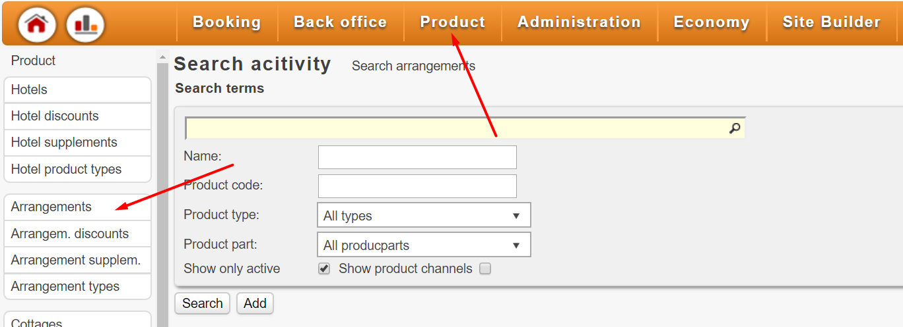

# Introduction

To be able to follow this guide you'll need access to, and basic familiarity of, the spreadsheet [COMERS OVERVIEW](https://docs.google.com/spreadsheets/d/1a2BTf9VfGQlScm0UR8xB2wzFnm_yhQC8VP4iIygmMeM/edit?ts=5c07f01d#gid=1416145104).   
The guide is divided into following parts and assumes the user completes the steps from beginning to end in this particular order:

* [**Create Arrangement**](../create-a-new-event/01. Create Arrangement.md)  
* [**Create Project**](../create-a-new-event/02. Create Project.md)  
* [**Create Package**](../create-a-new-event/03. Create Package.md)  
* [**Adding Product Capacity**  ](../create-a-new-event/04. Add Product Capacity.md)
* [**Adding Product Price**  ](../create-a-new-event/05. Add Product Price.md)
* [Adding Supplements  ](../create-a-new-event/06. Add Supplements.md)
* [Adding Discounts  ](../create-a-new-event/07. Add Discounts.md)

!!! Note    
    The parts marked in **bold** are required to make the event bookable.

_The guide is not meant to give a complete understanding of the concepts of Comers. Rather it's a written step-by-step instructions for creating and configuring new events in Comers._

---

### Conventions used in this guide

Click Menu: `Product > Arrangements`

!!! Note
    This means click `Product` tab in main menu followed by `Package` in the sidebar as illustrated in image below. 

---

Set `Name` to `$EVENT_NAME`

!!! Note
    This means, find the webelement named `Name` and write the value found in column `EVENT_NAME` in COMERS OVERVIEW.

---

### Logging in

Continue by logging in to Comers via [http://adminang.comers.se/](http://adminang.comers.se/) and click `Work without project`.

If this is your first time it's **strongly** recommended to log into [http://testadminang.comers.se/](http://testadminang.comers.se/) instead.
This site is a clone of [http://adminang.comers.se/](http://adminang.comers.se/) and will reset regularly.