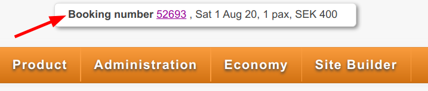
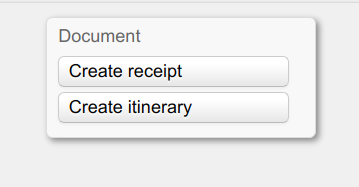

# Create booking for passed event  

_Comers Packages aren't bookable once the event has started._  

## Prerequisites  

Before you proceed make sure to have the necessary credentials  

- [**Comers**](https://adminang.comers.se)  

You'll also need:  

- The __exact__ name of the event. Let's call it `$EVENTNAME`  
- The starting date of `$EVENTNAME` in Comers format (_13.01.21_). Let's call it `$DATE_FROM`  
- The ending date of `$EVENTNAME` in Comers format (_23.01.21_). Let's call it `$DATE_TO`  
- The customer first name.  
- The customer last name.  
- The customer email.  
- The customer gender.  
- The customer diet.  

!!! Important  
    Make sure you **don't have** any booking active. If you see this box you've unsaved changes and need to `Confirm` or `Undo` those changes before continuing.  
      

## Overview  

* Select a discount code  
* Add Arrangement (which also creates a new Preliminary booking)  
* Add Hotels (Accommodation)  
* Update Project and contact information  
* Confirm booking  
* Get payment link  

!!! Note  
    After you _Confirm_ or _Change_ a booking you should always click `Create receipt` and `Create itinerary` buttons.  
      

## Video  

[This video](https://drive.google.com/file/d/16QJbPEKjeYJ-7cQJ5KlaHiY4FAApTN0p/preview) shows how to add a coordinator to *2021 First half of summer* after the event has started.  

<iframe width="100%" height="100%" style="position:absolute" frameborder="0" src="https://drive.google.com/file/d/16QJbPEKjeYJ-7cQJ5KlaHiY4FAApTN0p/preview" allowfullscreen></iframe>
  

---  
