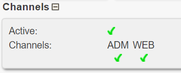

# Create Arrangement

* Click Menu: `Product > Arrangements`
* Click Button: `Add`

## Basic setup

#### Arrangement infomation
* Set `Product code` to `$PRODUCT_CODE`
* Set `Name` to `$EVENT_NAME`
* Set `Internal name` to `$EVENT_NAME`
* Set dropdown `Product type` to `$TYPE`

#### Booking
* In the **Booking** section, expand **More booking information**
    - Set `Max number of bookings` to `$MAX_BOOKINGS`

#### Bottom of the page
* Set Checkmark `Active` to **True**
* Click Button: `Save`

!!! Note
    'Arrangement inserted' should be shown on top of the page.

#### Channels
* In the **Channels** section, click and make sure `ADM` and `WEB` are both a green checkmark.

## Configuring Product Parts
Click Tab `Productparts`

* Activate checkmark for `Product part PAKET`
* Click Save

## Configuring Interest Groups
Click Tab `Interest groups`

* Activate checkmark for `Course` if `$TYPE` is **COURSE**
* Activate checkmark for `Festival` if `$TYPE` is **FESTIVAL**
* Click button `Spara` or `Save`

## Configuring Arrangement Price
Click Tab `Price`

* In the **New Price** section
    - Set both `From` and `To` to `$DATE_FROM`
    - Set `Grossprice` to `$PRICE`. *See note below*
    - Click Button: 'Lägg till'

!!! Note
    If `$EARLY_BIRD_PRICE` and `$EARLY_BIRD_DATE` is set in COMERS OVERVIEW; set `Grossprice` to `$EARLY_BIRD_PRICE` instead of `$PRICE`. For the dates you should use `$DATE_FROM` and *not* `$EARLY_BIRD_DATE`. 
!!! Note
    'Price inserted' should be shown on top of the page.
    

## Adding Arrangement Capacity
Click Tab `Capacity`

* In the **Add** section
    - Set `From` to `$DATE_FROM`
    - Set `To` to `$DATE_TO`
    - Set Dropdown `Capacity type` to `Allotment`
    - Set Dropdown `Product part` to `Package course/festival`
    - Set Checkmark `All` to **True**
    - Set `Capacity / day` to `$MAX_BOOKINGS`
    - Click Button: `Add`

!!! Note
    'Capacity inserted' should be shown on top of the page.

## Configure Arrangement Info

Click Tab `Info`

* Set `Kort beskrivning av produkten` to `$DESCRIPTION`
    - Click `Spara`
* Click `Upload image` button in the **Liten bild - 250 pixlar bred** section
    - Upload `$IMAGE` from Google Drive
    - Image should be resized to 250x167 pixels 
    - Click button `Spara` of `Save`

--- 

You've now completed the steps for creating the Arrangement. 
Continue to create the Project.
