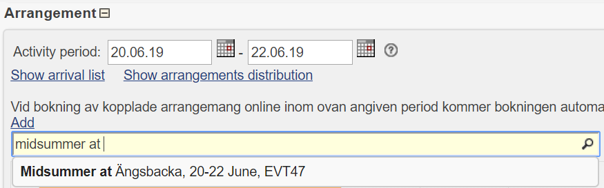

# Create a Project
* Click Menu: `Product > Project`
* Click Button: `Add`

## Add new Project
* Set `Project no` to `$PROJECT_NUMBER`
* Set `Short description` to `$EVENT_NAME`
* Set `Description` to `$EVENT_NAME`
* Set `Date period` to `$DATE_FROM` and `$DATE_TO`
* Click Button `Save`

!!! Note
    'Project inserted' should be shown on top of the page.

## Connect Arrangement to Project
* In the **Arrangement** section, use the yellow searchfield to find the arrangement named `$EVENT_NAME` created in earlier chapter. 

!!! Note
    'Product added' should be shown on top of the page.

---
You've now completed the steps for creating the Project. 
Continue to create the Package.