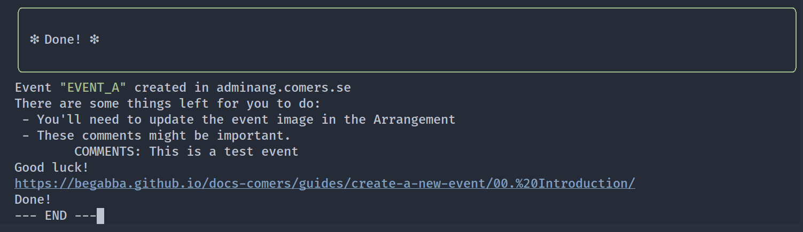
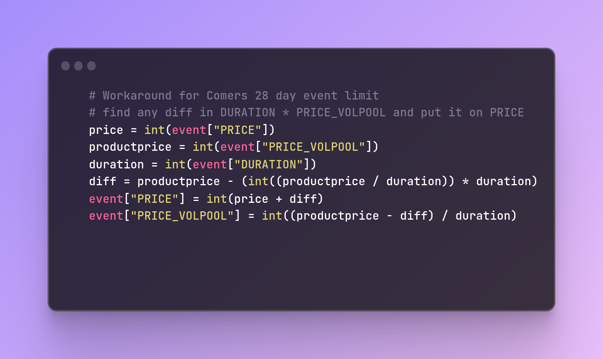

# Sheet-to-comers

<!-- TODO: rename is_summer_camp to USE_SUMMERCAMP_TWEAKS -->
<!-- TODO: cleanup folder (remove zip, move browser) -->
<!-- TODO: Simplify error: Could not create product with product code: -->

Sheet-to-comers is a software that creates events in Comers from data found in COMERS OVERVIEW.
It does this by opening a browser and clicking the necessary buttons in Comers for you.
Sheet-to-comers is currently **only available for Windows** (64-bit) computers.

You'll need to be familiar with the process of [Create new events](../guides/create-a-new-event/00.%20Introduction.md) in Comers. Sheet-to-comers follows the exact same steps as the guide.  
If this process is interrupted at any time you'll have to either:

1. Complete the process manually by following the [guide](https://begabba.github.io/docs-comers/guides/create-a-new-event/00.%20Introduction/)
2. Remove any traces of the created event from Comers and run Comers-to-sheet again.

## Installation

You'll find the latest version here: [sheet-to-comers.zip](https://drive.google.com/drive/folders/1UXP9iwGZBtSQwa5v9T6ISEFM0oH853NI?usp=sharing)

!!! Important
    Sheet-to-comers requires a Comers account with *Administration* rights.
    Make sure nobody is using this account while Sheet-to-comers is running.

## Creating your first event

- Before starting make sure to run `Validate` from `AwesomeBar` in [COMERS OVERVIEW](https://docs.google.com/spreadsheets/d/1a2BTf9VfGQlScm0UR8xB2wzFnm_yhQC8VP4iIygmMeM/edit?ts=5c07f01d#gid=1416145104).
- Doubleclick **sheet-to-comers.exe** to start Comers-to-sheet in a terminal window.
- If a *Windows Defender* windows pops up, click `More info` and `Run anyway`.
  : First run of Sheet-to-comers will ask you for Comers login credentials and download necessary Chrome/Chromedriver.
- Select the event by typing the event PRODUCT_CODE
  : Only events with **STATUS** set to **READY** in COMERS OVERVIEW will be available.
- USE_TEST_SITE?
  : Always create the event with USE_TEST_SITE **"Yes"** first.  
  Answering **"Yes"** will use [testadminang.comers.se](https://testadminang.comers.se) instead of [adminang.comers.se](https://adminang.comers.se)  
  testadminang.comers.se is a mirror of our Comers and is useful for testing things without the risk of breaking something.  
  This allows you to find any remaining issue with the event without having to clean up Comers afterwards.  
  **Any error message Comers outputs will be shown in the terminal. Be sure to read it!**

Now the clicking starts. Do not touch the computer while this is running.  

When the magic wand has finished some remaining tasks is shown. These task you'll need to do manually.

## Configuration

After your first run of Comers-to-sheet a file named `config.cfg` will be created.

| name           | description                                                       |
| -------------- | ----------------------------------------------------------------- |
| username       | Username for Comers login                                         |
| password       | Password for Comers login                                         |
| is_summer_camp | Enables the workaround for summer volunteer events                |
| headless       | If set to `False` the browser is visible while creating the event |
| post_url       | Don't mess with this!                                             |

Open `config.cfg` in `Notepad` or any other text editor to change the settings.

## Creating summer volunteer camps

I'm sorry. Prepare for confusion.  
The maximum length of an Product price in Comers is 28 days. If the event is longer than that we'll need to use per-day pricing instead.
The workaround is to set `is_summer_camp` to `True` in `config.cfg` before creating any of the summer volunteer camps.

**Short version:**
1. Set the price for `PRICE_VOLPOOL` to exactly `1` in COMERS OVERVIEW.  
2. Set `is_summer_camp` to `True` in `config.cfg`.  
3. Create the summer events.  
4. Manually create `Freesale` product capacity from _start of first event_ til _end of the last event_.  
5. Skip reading the rest of this section.  

!!! Important
    `PRICE_VOLPOOL` must be greater than `0` for Comers-to-sheet to work when using `is_summer_camp`.
    If `PRICE_VOLPOOL` is set to `1`, then Comers-to-sheet will set the price in Comers to `0`.
    If `PRICE_VOLPOOL` is set to any number higher than `1` it will calculate the per-day price based on the event duration.

Enabling `is_summer_camp` has two major differences:

- No Product capacity is created.
  : Instead it's suggested that you manually create `Freesale` capacity for `VOLPOOL` once for the whole summer . Set the capacity starting date to the _start of the first event_ and capacity end date to the _end of the last event_.

- Sheet-to-comers creates _Product price_ that uses **per-day** price instead of **total** price.
  : Any remaining difference is put on Arrangement price. This might lead to some weird looking prices but the total price will be the same.
    You can always massage the Arrangement/Product price after the event is created.

## Troubleshooting

### Comers-to-sheet fails to start

Remove all files and reinstall Comers-to-sheet.
This should reset everything and force Comers-to-sheet to reinstall it's dependencies.

<!-- Next you could try to run Comers-to-sheet from a Windows terminal. -->
<!-- * TODO: Screenshot -->
<!-- * Right-click in Comers-to-sheet folder -->
<!-- * Click open ... -->
<!-- * Write `comers-to-sheet.exe` and press enter -->
<!-- : This will prevent the window from automatically closing and give the opportunity to read any error message. -->
