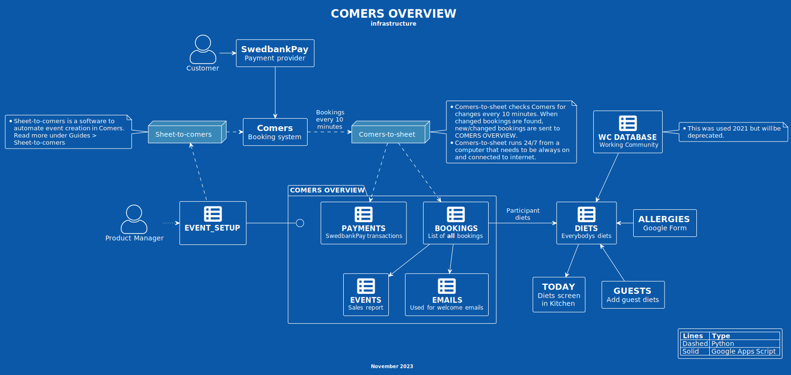

# Welcome  

Here's some Comers related how-to guides I don't want to write twice.  
**Feel free to bookmark this page.**  

- [**Create a new event**](./create-a-new-event/00. Introduction.md)  
- [**Cancel an event**](./cancel-event/00.%20Cancel%20an%20event.md)  
- [**Refund a booking**](./refund-a-booking.md)  
- [**Transfer booking to another event**](./transfer-booking-to-another-event.md)  
- [**Create booking for passed event**](./create-booking-for-past-event.md)  

## Overview

## TODO | project:last
* [X] Create overview of current automations  #08f09308
* [X] Guide for updating Selenium Chrome driver  #97e3d7e9
* [ ] Delegate monitor of angbacka@gmail.com  #029d4467
* [ ] Convert budget spreadsheet to Google Sheets  #7705e958
* [ ] Make certain Python tools more accessible (create & cleanup events)  #9f423802
* [ ] Transfer all Google Apps Script projects to another user  #9c9d5e84
* [ ] Transfer ownership of important documents and remove the rest.  #0f625b50
* [ ] Deprecate or keep gas-vol-admin? Discuss!  #32ea198f
* [ ] Update passwords on GS in wardrobe office  #5e04163d
* [ ] Remove erik@angsbacka.com & Slack  #c0cee4f3

<!-- * [**Glossary**](./glossary.md) -->  
