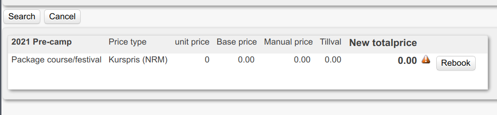
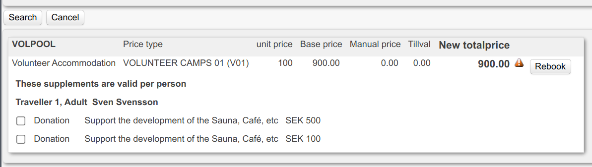
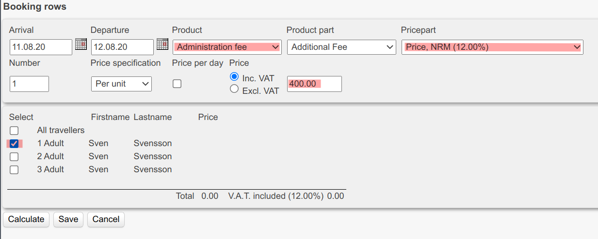

# Transfer booking  

_This guide contains a step-by-step instruction on how to make transfer a booking to another event._  

## Overview  

- [Change Project](#change-project)  
- [Change Arrangement](#change-arrangement)  
- [Change Accommodation](#change-accommodation)  
- [Add Administration Fee](#add-administration-fee)  
- [Update payment](#update-payment)  

---  

## Prerequisites  

Before you proceed make sure to have the necessary credentials:  

- [**Comers**](https://adminang.comers.se)  
- If the price for the new event is lower than the old event you'll also need the prerequisites from [**How to make a refund**](./refund-a-booking.md)  

You'll also need:  

- The __exact__ name of the new event. Let's call it `$EVENTNAME`  
- The starting date of `$EVENTNAME` in Comers format (_13.01.21_). Let's call it `$DATE_FROM`  
- The ending date of `$EVENTNAME` in Comers format (_23.01.21_). Let's call it `$DATE_TO`  

_Make sure you're aware of any administration/cancellation fees according to the booking policies:_  

- [Course/Retreat](https://www.angsbacka.com/about-angsbacka/course-retreat-booking-policy/)  
- [Festivals](https://www.angsbacka.com/about-angsbacka/festival-ticket-policy/)  

!!! Warning  
> If original payment was made with Swish, stop here and consult Erik or Malin  

---  

## Detailed instruction  

### Change Project  

- Go to booking  
- Click button `Change`  
- Move mouse over `Project` in the upper left part of the page.  
  
- Click menu item `Change project`  
- Click button `Search` and a list of all valid Projects will show  
- Click link `Select` on the Project named `$EVENTNAME`  

_You're doing great!_  

---  

### Change Arrangement  

- Scroll to the bottom of the booking.  
- Move mouse over __speech bubble__ on the yellow row.  
  
- Click menu item `Ändra produkt` _(Change product)_  
- Set `Change to product` to `$EVENTNAME`  
- Set `from` to `$DATE_FROM`  
- Click button `Search`  

There should be exactly one option available. If there's price difference a small triangle will appear in `New totalprice`.  
  

- Click button `Rebook`. A message will appear if there's a price difference.  

_You're doing great!_  

**[⬆ Back to Top](#overview)**  

---  

### Change Accommodation  

This is pretty similar to what we did in [Change Arrangement](#change-arrangement)  

- Scroll to the bottom of the booking page.  
- Move mouse over __speech bubble__ on the green row.  
  
- Click menu item `Ändra produkt` _(Change product)_  
- _OPTIONAL_: Set `Change to product` to customer preference  
- Set `from` to `$DATE_FROM`  
- Set `to` to `$DATE_TO`  
- Click button `Search`  

There should be exactly one option available. If there's price difference a small triangle will appear in `New totalprice`.  
  

- Click button `Rebook`. A message will appear if there's a price difference.  

_You're doing great!_  

**[⬆ Back to Top](#overview)**  

---  

### Add administration fee  

If you need to add any fee according to our booking policies:  

- Click button `Specialprodukter`  
- Set `Product` to `Administration fee`  
- Set `Pricepart` to `Price, NRM (12.00%)`  
- Update price  
- Set checkbox `1 Adult` to checked  
- Click button `Save`  

  

**[⬆ Back to Top](#overview)**  

---  

### Update payment  

If you haven't already, click button `Confirm` in the bottom of the booking page.  
Also click `Create reciept` & `Create itinerary` buttons if possible.  

The changes we've made might've changed to `Remains to be paid:`.  

- Scroll to top of the booking page  
- if `Remains to be paid:` is a negative number:  
  - Follow the guide on [**How to make a refund**](./refund-a-booking.md)  
- if `Remains to be paid:` is a positive number:  
  - Go to the **Contact** tab  
    - In the section **E-post**:  
        - Verify `Sender` makes sense.  
        - Set `--- Select a message on the customers language ---` to `Payment reminder`  
        - Update the message but keep the "My booking" link  
    - In the section **Attach files**:  
        - Make sure neccessary attachments are included, if any.  
    - Click button `Send` in section **E-post**  

**[⬆ Back to Top](#overview)**  

---  

### Celebrate  

**Congratulations!** You're truly a beautiful flower that brings joy to this world.  

_Now, let's do another one._  

**[⬆ Back to Top](#overview)**  

---  
