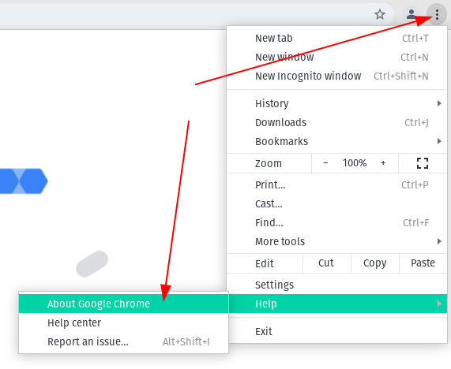
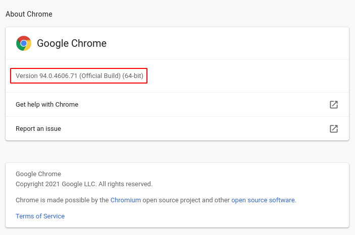
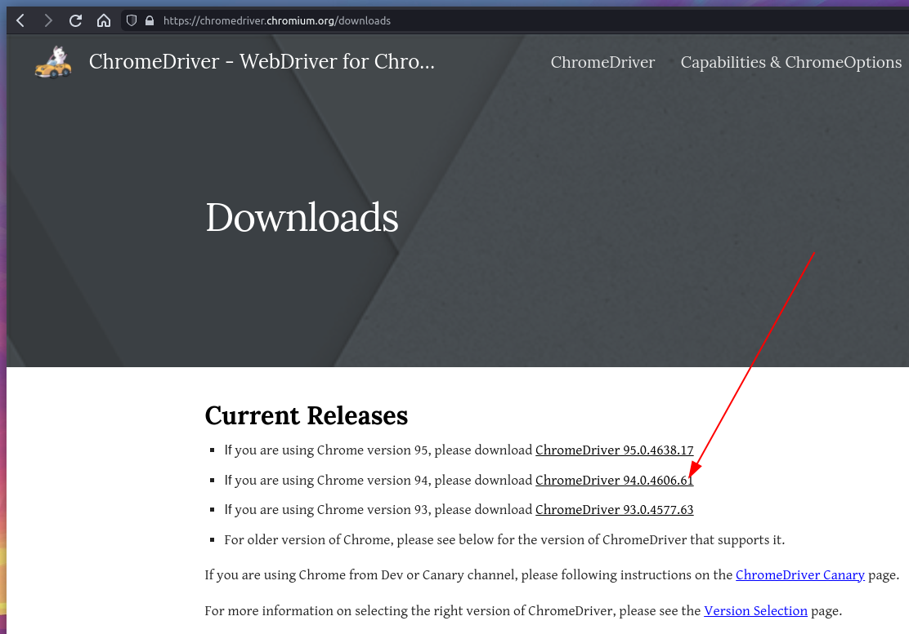
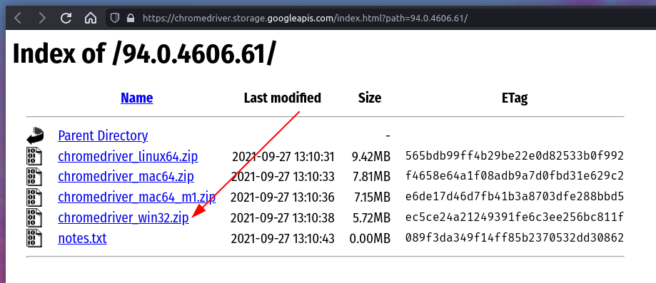

# Troubleshooting
_Issues aren't common, but here's the common issues._

## Error message or blank window in Spreadsheet?

> "ScriptError: We're sorry, a server error occurred while reading from storage.  
  Error code PERMISSION_DENIED."

This is a bug in Google Sheet that occurs when user is logged in to multiple accounts. The code runs as the _default account_ (first), not the active account, which results in PERMISSION_DENIED.
Google has been aware of this bug since November, 2017 and still hasn’t fixed it so it’s best to plan on working around this issue for the time being. While there is not great solution, there are a few options:

1. Log out of all accounts and log in with the angsbacka.se account first. This is the most reliable long term solution.
2. Use an incognito / private window. An incognito window is logged out of all accounts by default so logging in with the work account will cause it to be the only logged in account. This is great for a quick fix, but logging in multiple times can be cumbersome.
3. Use a seperate browser for different accounts. This is a variation of #2. By devoting an entire browser to work and another to personal accounts it avoids this problem and because the session isn’t in an incognito / private window you can stay logged in over time.

## New bookings isn't shown in COMERS OVERVIEW?
Normally new bookings should show up in COMERS OVERVIEW within 10 minutes. If it's been more than a day since last update I suggest you follow this guide.

A newer version on Google Chrome has probably been released and we'll need to update the Selenium Chrome driver on the computer in the wardrobe office. Don't you worry, it's easy.

Find out what's the current version of Google Chrome is.

_In this case the version is 94._

Once we know the Google Chrome version we'll download the Selenium Chrome driver:
[https://chromedriver.chromium.org/downloads](https://chromedriver.chromium.org/downloads)

Extract the content of this archive to `C:\FILES\ANGSBACKA\PYTHON` and replace the old `chromedriver.exe`.

We're done. Restart the computer. It will automatically login and start the necessary software.
It might take an hour or two before all bookings are updated.

## Other
One common issue is that the user accidentally deleted or modified the header (top row) in the Spreadsheets. Make sure the top row is intact and spelled **exactly** as it should. These accidents can be addressed by adding a **Protected Range** on the first row.

Most automations create a log on a successful or failed run. 
If the `IAM & Admin` permissions allow it you can access the [logs in Google Cloud Platform with the project `internal-tools`](https://console.cloud.google.com/logs/viewer?project=internal-tools-250408&organizationId=500938257644&minLogLevel=0&expandAll=false&timestamp=2021-10-12T07:37:40.013000000Z&customFacets=&limitCustomFacetWidth=false&interval=PT1H&resource=app_script_function&dateRangeUnbound=both&scrollTimestamp=2021-10-12T07:09:46.652000000Z).

Sometimes the logs can be a bit cryptic but it a great way to start troubleshooting.

`Cannot read property of undefined`
: This often means on of the header is missing.

Good luck!
